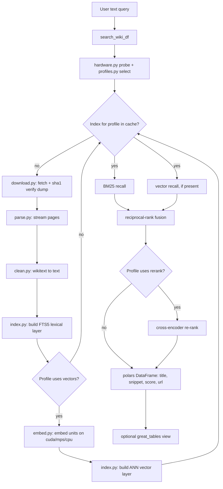

# Design plan: `bestee.wiki` — Wikipedia dump download + text query

Status: **draft / proposal**
Owner: TBD
Scope: a new subpackage that (1) downloads the latest Wikipedia content dump
and (2) answers "find me the most relevant pages for this text query".

---

## 1. Goals & non-goals

### Goals
- Download the **latest** Wikipedia article dump reproducibly, with checksum
  verification and resumable transfers.
- Build a **local, queryable index** over the article text.
- Expose a small public API consistent with the rest of `bestee`:
  free functions, `polars` DataFrames internally, optional `great_tables.GT`
  display wrappers, structured `logging`, Google-style docstrings.
- Given a user's free-text query, return the **top-N most relevant pages**
  (title, snippet, score, URL).

### Non-goals (at least for v1)
- Live/online querying of Wikipedia (this is an *offline dump* tool).
- Editing/round-tripping wikitext.
- Rendering full article HTML.
- Multi-language search (start English-only; design leaves room for it).

---

## 2. The hard constraint: dump size

This dominates every design decision, so it goes first.

| Dump | Compressed | Uncompressed | Random access? |
|------|-----------:|-------------:|----------------|
| `enwiki-latest-pages-articles.xml.bz2` (full, single stream) | ~22 GB | ~95 GB | No (must stream sequentially) |
| `enwiki-latest-pages-articles-multistream.xml.bz2` + index | ~22 GB | ~95 GB | **Yes** (index gives byte offset per page) |
| `simplewiki-latest-pages-articles.xml.bz2` (Simple English) | ~300 MB | ~1.5 GB | No |

**Recommendation:** support a configurable `wiki` + `dump` selector, but make
**Simple English (`simplewiki`) the default for the MVP** and for tests. It is
the same schema and ~50x smaller, so the whole pipeline (download → parse →
index → query) is exercisable on a laptop in minutes. Full `enwiki` is then
"the same code with a bigger input and longer index build", and we use the
**multistream** variant so we never need to hold the corpus in memory.

---

## 3. Where it lives

```
src/bestee/wiki/
    __init__.py        # public API re-exports
    sources.py         # dump catalog: URLs, mirrors, filenames, wiki/lang config
    download.py        # resumable download + checksum verification
    cache.py           # local cache dir resolution + manifest
    parse.py           # streaming bz2 + XML page iterator (+ multistream offsets)
    clean.py           # wikitext -> plain text normalization
    hardware.py        # probe cores/RAM/disk/accelerator -> HardwareProfile
    profiles.py        # named quality profiles + auto-selection logic
    embed.py           # embedding backend (device auto-select: cuda/mps/cpu)
    index.py           # build lexical + vector index from parsed pages
    query.py           # public query entrypoints (-> DataFrame / GT)
    models.py          # dataclasses / enums (WikiSource, Page, SearchHit, ...)
tests/
    test_wiki_parse.py
    test_wiki_query.py
    test_wiki_profiles.py              # profile selection logic (no hardware needed)
    fixtures/
        sample-pages-articles.xml      # ~10 hand-picked pages, committed
```

This mirrors the existing `stocks/` and `etf/` package shape (a `models.py`,
focused single-responsibility modules, a thin `__init__.py` re-export surface).

---

## 4. Component breakdown

### 4.1 `sources.py` — dump catalog
- An enum/dataclass describing a downloadable dump:
  ```python
  @dataclass(frozen=True)
  class WikiSource:
      lang: str          # "simple", "en", ...
      project: str       # "wiki"
      multistream: bool  # use random-access variant
      mirror: str        # base URL
  ```
- Resolve concrete file URLs for `latest`:
  - data: `{mirror}/{project}{lang... }/latest/...-pages-articles[-multistream].xml.bz2`
  - index (multistream only): `...-pages-articles-multistream-index.txt.bz2`
  - checksums: `...-sha1sums.txt` (or `dumpstatus.json`) for verification.
- Ship a couple of known mirrors (`dumps.wikimedia.org` + a fallback mirror)
  so a flaky primary doesn't block downloads.

### 4.2 `cache.py` — local storage
- Cache root resolution order: explicit arg → `BESTEE_WIKI_CACHE` env →
  platform default (`~/.cache/bestee/wiki`). Keep the `.env` pattern already
  used in `client.py`.
- A small JSON **manifest** per cache: which dump, download date, source URL,
  sha1, byte size, and which derived artifacts (index DB) exist and are fresh.
- Add the cache dir to `.gitignore`.

### 4.3 `download.py` — resumable, verified fetch
- Use the already-present **`httpx`** dependency. Stream to a `.part` file in
  chunks; support HTTP `Range` resume if a partial file exists.
- Show progress via the `logging` module (bytes / % at INFO, throttled).
- After download: verify **sha1** against the published sums; on mismatch,
  delete and raise. Atomically rename `.part` → final on success.
- Be a polite client: single connection, sensible timeouts, descriptive
  `User-Agent` (Wikimedia asks for this), honor `Retry-After`.

### 4.4 `parse.py` — streaming page iterator
- Core primitive:
  ```python
  def iter_pages(path: Path) -> Iterator[RawPage]: ...
  ```
  Decompress bz2 in a stream and pull `<page>` elements with
  `xml.etree.ElementTree.iterparse`, **clearing elements after each page** to
  keep memory flat regardless of dump size.
- Filter to article namespace (`ns == 0`); drop redirects, talk pages, etc.
- For multistream: parse the `*-index.txt.bz2` into `(byte_offset, page_id,
  title)` rows so we can later seek to and decompress a single ~100-page block
  to fetch one article's full text on demand (random access).

### 4.5 `clean.py` — wikitext → plain text
- Strip wiki markup to searchable plain text (templates, links, refs, tables,
  HTML comments). Use a dedicated library (`mwparserfromhell`) rather than
  hand-rolled regex — markup edge cases are endless.
- Produce, per page: `title`, `plain_text`, and a short `summary` (lead
  paragraph) used for result snippets.

### 4.6 `index.py` — the searchable index
The index has **two always-present layers** plus an **optional third**, all
built in one pass over the pages:

1. **Lexical layer (always on): SQLite FTS5 / BM25.** Built into stdlib
   `sqlite3`, gives BM25 ranking out of the box.
   - Schema: `pages(id, title, url)` + `pages_fts` virtual table over
     `title, summary, body` with per-column weights (title boosted, per the
     `List of English kings` discussion). Index redirect titles as synonyms;
     use the `porter` tokenizer for stemming.
   - One file, `index.sqlite`, in the cache. Fast build, tiny deps, persists
     trivially, supports phrase/prefix queries.

2. **Vector layer (semantic): embeddings + ANN.** Embed each unit (lead /
   article / chunk — see profile) and store vectors for nearest-neighbor
   search. This is what bridges `kings` ↔ `monarchs` and answers vague
   natural-language queries. Built via `embed.py` (device auto-selected) into
   a FAISS or `sqlite-vec` index alongside `index.sqlite`.

3. **Re-rank layer (optional, top tiers): cross-encoder.** After retrieval,
   re-score the top ~100 candidates with a cross-encoder for a large
   precision boost on the final ordering. Enabled only when the active
   profile's hardware budget allows.

The **lexical layer is mandatory and cheap**; the vector and re-rank layers are
enabled and *sized* by the active hardware profile (§4.7). The query path
(§4.8) is **hybrid by default**: BM25 recalls candidates, the vector layer
recalls semantic candidates, the union is fused (reciprocal-rank fusion) and
optionally cross-encoder re-ranked. Each stage is feature-gated by capability,
so the *same* query API degrades gracefully to BM25-only when embeddings are
unavailable, and upgrades automatically when they are.

### 4.7 `hardware.py` + `profiles.py` — adaptive quality
This is what lets the tool **improve relevance as hardware improves** without
code changes.

**`hardware.py` — capability probe.** Detect and return a `HardwareProfile`:
CPU core count, total/available RAM, free disk in the cache dir, and the best
available accelerator (CUDA via `torch.cuda.is_available()`, Apple Metal via
`torch.backends.mps.is_available()`, else CPU) plus VRAM if discoverable.
Degrades gracefully if `torch` isn't installed (reports CPU-only).

**`profiles.py` — quality profiles.** Relevance is a continuum across five
independent axes; a *profile* is a named point on that frontier:

| Axis | cheap → expensive |
| --- | --- |
| Granularity | lead paragraph → full article → passage chunks |
| Embedding model | MiniLM-384 → bge-base-768 → bge-large/e5-1024 |
| Vector precision | PQ/int8 → int8 → float16 → float32 (exact) |
| Search method | IVF+PQ (approx) → HNSW → flat (exact) |
| Re-ranking | none → cross-encoder reranker |

Named presets map a hardware budget onto concrete settings:

| Profile | Targets | Granularity | Model | Vectors | Re-rank |
| --- | --- | --- | --- | --- | --- |
| `lexical` | no ML deps | — (BM25 only) | — | — | — |
| `economy` | ≤16 GB RAM, CPU/MPS | lead only | MiniLM-384 | int8 + HNSW | no |
| `standard` | 32–64 GB, MPS/GPU | full article | bge-base-768 | int8 + HNSW | light |
| `quality` | GPU + 64 GB | passage chunks | bge-large-1024 | fp16 + HNSW | cross-encoder |
| `max` | big GPU + lots RAM/disk | fine chunks | bge-large-1024 | fp32 flat (exact) | strong cross-encoder |

**Auto-selection.** `profile="auto"` (the default) probes the hardware and picks
the **highest preset whose estimated RAM/disk/accelerator budget fits**, with
headroom for the OS. Selection is pure arithmetic over the `HardwareProfile`
and the corpus's vector-count estimate, so it's fully unit-testable with
synthetic profiles (no real hardware needed). Users can also pin a profile
explicitly, or override individual axes (`model=`, `granularity=`,
`rerank=`) for fine control.

**Accelerator awareness (not all GPUs are CUDA).** Selection must distinguish
*memory budget* from *build throughput*, because Apple Silicon decouples them:
- **Unified memory counts as VRAM.** On `accel='mps'`, the whole RAM pool is
  GPU-accessible, so the RAM-based fit test *is* the VRAM test. A 128 GB
  high-end Apple Silicon laptop (e.g. an M5 Max-class machine) can therefore
  hold a passage-chunked **full-enwiki** vector index in memory (fp16 ≈ 40 GB)
  and run **exact flat search** — a config a 16 GB machine cannot, regardless
  of its GPU.
- **MPS accelerates embeddings + cross-encoder rerank**, so those layers select
  `device='mps'` automatically. But **`faiss-gpu` is CUDA-only**, so ANN
  build/search stays on CPU (`faiss-cpu`/`hnswlib`) — fine at these sizes given
  the memory headroom.
- **Build throughput is weighted by accelerator class** (`cpu < mps < cuda`,
  ~3–10× steps), read from the live probe rather than any hardcoded chip name
  — so newer Apple Silicon (M5-class and beyond) simply reports a higher MPS
  throughput weight and clears the build gate more easily, no code change. On
  Apple, `auto` may *fit* the heaviest tier in memory yet **flag a long
  MPS-bound build** (passage-chunking enwiki with a large model) and resolve
  one tier down, leaving `--profile max` as an explicit opt-in. The fit test
  and the throughput test are separate gates.

**Upgrade path.** The index manifest records the profile/model/params it was
built with. On a better machine, `auto` selects a higher preset; re-running the
build (`bestee wiki index --profile auto`) regenerates a richer index, and the
query side simply loads whatever artifacts are present. So "better hardware →
better results" is a re-index, not a rewrite.

### 4.8 `query.py` — public surface
Match `bestee` conventions (`*_df` core + `GT` wrapper, keyword-only args):

```python
def search_wiki_df(
    query: str,
    *,
    source: WikiSource | None = None,
    limit: int = 10,
    profile: str = "auto",       # "auto" | "lexical" | "economy" | ... | "max"
    rerank: bool | None = None,  # None = follow profile default
    cache_dir: Path | None = None,
) -> pl.DataFrame: ...
    # columns: rank, score, title, snippet, url, page_id

def search_wiki(query: str, *, limit: int = 10, profile: str = "auto", ...) -> GT:
    # great_tables display wrapper, like get_all_tickers()
```

`search_wiki_df` lazily ensures an index exists for the active `profile`
(download + build on first use, controlled by an `auto_build: bool` flag) and
then runs the hybrid query. The `profile` resolves through `profiles.py`:
`"auto"` probes the hardware and selects the best feasible preset. If only a
lexical index is present, it transparently serves BM25-only results. Snippets
come from FTS5's `snippet()`/`highlight()` helpers.

---

## 5. End-to-end flow



First call is slow (download + build, one time per dump+profile). Every
subsequent query hits the prebuilt index and is fast. Building at a higher
profile (after a hardware upgrade) just adds/replaces the vector + rerank
layers; the lexical layer is reused.

---

## 6. Public API (proposed `wiki/__init__.py`)

```python
from bestee.wiki.models import WikiSource, SearchHit
from bestee.wiki.hardware import probe_hardware, HardwareProfile
from bestee.wiki.profiles import resolve_profile, list_profiles
from bestee.wiki.download import download_dump
from bestee.wiki.index import build_index
from bestee.wiki.query import search_wiki, search_wiki_df

__all__ = [
    "WikiSource", "SearchHit", "HardwareProfile",
    "probe_hardware", "resolve_profile", "list_profiles",
    "download_dump", "build_index",
    "search_wiki", "search_wiki_df",
]
```

`probe_hardware()` / `resolve_profile()` are exposed so users can ask "what
will `auto` pick on this machine?" before committing to a (possibly long)
build. Optionally expose `search_wiki` at the top-level `bestee.__init__` once
stable.

---

## 7. Command-line interface

A `wiki` subcommand group hangs off the existing `bestee` entry point
(`[project.scripts] bestee = "bestee.main:main"`). Built on stdlib **`argparse`**
(no new deps), dispatching to the same library functions in §6 — the CLI is a
thin wrapper, never a second implementation.

```
bestee wiki status                 # hardware probe + resolved `auto` profile + cache state
bestee wiki download [opts]        # fetch + sha1-verify the dump (resumable)
bestee wiki index    [opts]        # build/refresh the index at a profile
bestee wiki search "<query>" [opts]# query the index
bestee wiki info     [opts]        # show the cache manifest (dump, profile, sizes)
bestee wiki clear    [opts]        # delete cached artifacts (dump and/or index)
```

Common options (resolve to the same kwargs as the library):

| Flag | Meaning | Default |
| --- | --- | --- |
| `--lang {simple,en,...}` | which Wikipedia | `simple` |
| `--dated YYYYMMDD` | pin a specific dump instead of `latest` | `latest` |
| `--profile {auto,lexical,economy,...,max}` | quality profile | `auto` |
| `--limit N` | results to return (`search`) | `10` |
| `--rerank / --no-rerank` | force cross-encoder rerank on/off | profile default |
| `--cache-dir PATH` | override cache location | `$BESTEE_WIKI_CACHE` / `~/.cache/bestee/wiki` |
| `--json` | machine-readable output (for piping) | off (pretty `GT`/table) |
| `--force` | rebuild/redownload even if cached + fresh | off |

Key behaviors:
- `search` **auto-builds on demand**: if no index exists it runs
  download → index for the resolved profile first (suppress with
  `--no-auto-build` to fail fast instead).
- `status` is the "what will `auto` pick here?" command — run it before a long
  build. It prints the `HardwareProfile`, the selected preset, and whether a
  higher preset would be reachable with more RAM / a GPU.
- Every command accepts `--json` so the tool composes in scripts/pipelines.

---

## 8. Full lifecycle examples

### 8.1 First run — CLI (explicit steps)
```sh
# 1. See what this machine can do before committing to a build.
$ bestee wiki status
hardware : 8 cores, 16.0 GB RAM (11.2 GB free), 269 GB free disk, accel=mps
profile  : auto -> economy   (lexical + MiniLM-384 int8, no rerank)
note     : 'quality' needs ~64 GB RAM or a CUDA GPU; not available here
cache    : empty (simplewiki)

# 2. Download + verify the latest Simple English dump (~300 MB, resumable).
$ bestee wiki download --lang simple
downloading simplewiki-latest-pages-articles-multistream.xml.bz2
[#####################........] 71%  214/302 MB  4.1 MB/s
sha1 OK  ->  ~/.cache/bestee/wiki/simplewiki/20240601/dump.xml.bz2

# 3. Build the index at the auto-selected profile (one-time, ~2 min here).
$ bestee wiki index --lang simple --profile auto
profile=economy  parsing+cleaning 241,318 pages ... done (38s)
lexical (FTS5)   built 241,318 docs                ... done (12s)
vector  (MiniLM) embedded 241,318 leads on mps     ... done (61s)
ann     (HNSW)   int8, 241,318 x 384               ... done (7s)
index ready -> ~/.cache/bestee/wiki/simplewiki/20240601/index.economy/

# 4. Query it.
$ bestee wiki search "List of English kings" --limit 5
rank  score  title                       snippet
   1  0.94   List of English monarchs    The monarchs who ruled the Kingdom of ...
   2  0.81   List of British monarchs    Sovereigns of the United Kingdom and ...
   3  0.77   Kingdom of England          A sovereign state on the island of ...
   4  0.69   Anglo-Saxon England         The early medieval period of English ...
   5  0.66   House of Plantagenet        Royal house that ruled England from ...
```

### 8.2 First run — one-liner (auto-build)
```sh
# No prior download/index: search performs the whole pipeline, then queries.
$ bestee wiki search "rulers of medieval Britain" --lang simple
# (downloads + builds economy index on first call, then returns hits; instant after)
```

### 8.3 First run — library (mirrors the CLI)
```python
from pathlib import Path
from bestee.wiki import (
    WikiSource, probe_hardware, resolve_profile,
    download_dump, build_index, search_wiki, search_wiki_df,
)

src = WikiSource(lang="simple", project="wiki", multistream=True)

# Inspect what `auto` will choose (optional).
hw = probe_hardware()
print(hw)                          # HardwareProfile(cores=8, ram_gb=16.0, accel='mps', ...)
print(resolve_profile("auto", hw, source=src))   # 'economy'

# Explicit pipeline.
dump = download_dump(src)                         # -> Path, resumable + sha1-verified
build_index(src, profile="auto")                  # builds index.economy/

# Query: GT table for display, or a polars DataFrame for programmatic use.
search_wiki("List of English kings", limit=5).show()

df = search_wiki_df("List of English kings", limit=5)
print(df.select("rank", "title", "score"))
#  Or auto-build on first query (no explicit download/build needed):
#  search_wiki_df("List of English kings")  # downloads+builds once, then queries
```

### 8.4 Resource regeneration A — hardware upgraded
You moved the same cache to a 64 GB box with a CUDA GPU (or added one). The
lexical layer and downloaded dump are reused; only the richer layers rebuild.
```sh
$ bestee wiki status --lang simple
hardware : 24 cores, 64.0 GB RAM, accel=cuda (24 GB VRAM)
profile  : auto -> quality    (currently built: economy)   <-- upgrade available
cache    : simplewiki 20240601, dump OK, index.economy present

# Regenerate at the now-reachable higher profile (reuses dump + can reuse FTS5).
$ bestee wiki index --lang simple --profile auto --force
profile=quality  re-chunking into passages ...      done
vector  (bge-large-1024) embedding on cuda ...      done (4m)
rerank  cross-encoder enabled
index ready -> .../index.quality/   (economy index kept; query picks best present)

# Same query, materially better ranking + a rerank pass — API unchanged.
$ bestee wiki search "rulers of medieval Britain" --limit 5
```
```python
# Library equivalent:
build_index(src, profile="auto", force=True)   # picks 'quality' on this hardware
search_wiki("rulers of medieval Britain").show()   # automatically uses the richer index
```
Nothing in the calling code changed; better hardware → better results is purely
a re-index.

### 8.5 Resource regeneration B — newer dump released
```sh
# Wikimedia published a fresh dump; refresh data, then rebuild the index.
$ bestee wiki download --lang simple --refresh      # fetches newer 'latest', verifies
$ bestee wiki index    --lang simple --profile auto # rebuild against the new data
$ bestee wiki info     --lang simple
dump   : simplewiki 20240615 (sha1 OK, 0.30 GB)
index  : economy  (241,902 docs)  built 2024-06-16
```
```python
download_dump(src, refresh=True)
build_index(src, profile="auto")
```

### 8.6 Resource regeneration C — scale up to full English Wikipedia
```sh
# Bigger corpus, same commands. status warns about budget up front.
$ bestee wiki status --lang en
profile : auto -> economy   (16 GB RAM: enwiki vectors must be int8-quantized)
note    : 'quality'/passage-chunks not feasible at 16 GB; use a GPU box or smaller profile

$ bestee wiki download --lang en          # ~22 GB multistream dump
$ bestee wiki index    --lang en --profile economy   # hours: parse/clean dominate
$ bestee wiki search "List of English kings" --lang en
```
```python
en = WikiSource(lang="en", project="wiki", multistream=True)
download_dump(en)
build_index(en, profile="economy")          # or 'auto'
search_wiki("List of English kings", source=en).show()
```

### 8.7 Housekeeping
```sh
$ bestee wiki info  --lang simple          # manifest: dump date, sha1, profiles built, sizes
$ bestee wiki clear --lang simple --index  # drop indexes, keep the verified dump
$ bestee wiki clear --lang simple          # drop everything for this wiki
```

---

## 9. Dependencies to add
Layered so the core install stays lean and ML deps are opt-in. Capability is
detected at runtime, so the *same* code runs on any tier of install.

- **`wiki` (lexical, always works):** beyond stdlib + existing `httpx`/`polars`
  (bz2, sqlite3, xml are stdlib), just `mwparserfromhell` for robust wikitext
  cleaning. Enables `lexical` profile (BM25) with zero ML weight.
- **`wiki-semantic` (the `economy`–`max` profiles):** `sentence-transformers`
  (pulls `torch`) + a vector store (`faiss-cpu` or `sqlite-vec`). `torch`
  doubles as the accelerator probe (CUDA / MPS detection in `hardware.py`).
- **`wiki-gpu` (convenience):** a CUDA `torch`/`faiss-gpu` pin for users who
  want maximum build throughput on an NVIDIA box.

Declare these under `[project.optional-dependencies]` in `pyproject.toml`.
`profiles.py` checks which extras are importable and caps `auto` accordingly
(e.g. no `torch` installed → `auto` resolves to `lexical`, never crashes).

---

## 10. Testing strategy
- Commit a tiny `fixtures/sample-pages-articles.xml` (~10 real-ish pages incl.
  a redirect and a non-article namespace) — **no network in unit tests**.
- `test_wiki_parse.py`: page count, redirect/namespace filtering, memory stays
  flat (element clearing), wikitext cleaning of a known sample.
- `test_wiki_query.py`: build an in-memory/temp FTS5 index from the fixture,
  assert expected ranking for a couple of queries; assert DataFrame schema and
  the `GT` wrapper builds.
- `test_wiki_profiles.py`: feed **synthetic `HardwareProfile`s** (16 GB CPU,
  64 GB + GPU, etc.) to `resolve_profile` and assert the expected preset is
  picked, that missing `torch` caps `auto` to `lexical`, and that explicit
  pins/overrides win. Pure logic — no real hardware or ML deps needed.
- Mark any real-download / real-embedding test `@pytest.mark.network` /
  `@pytest.mark.slow` and skip by default.
- Keep ruff (`E,F,I,N,W,UP`) + ty clean; follow existing docstring style.

---

## 11. Risks & open questions
- **Disk/time for full enwiki** (~95 GB uncompressed, index build can take
  hours). Mitigation: default to `simplewiki`; document enwiki requirements;
  consider category-filtered subsets.
- **Dump cadence/availability:** `latest/` is regenerated ~twice a month and
  occasionally mid-regeneration. Verify via `dumpstatus.json` before trusting
  `latest`, and pin a dated dump (`YYYYMMDD`) for reproducibility.
- **Relevance quality:** the adaptive design sidesteps the "BM25 vs semantic"
  either/or — lexical is always there, semantic/rerank layer in as hardware
  allows. Open question is just *how many* named presets to ship initially.
- **Profile-budget estimates:** `auto` relies on heuristics for vector-count
  and RAM-per-vector. These should be calibrated against a real `simplewiki`
  build and revised; over-optimistic estimates risk OOM at query time.
- **Index portability / prebuilt artifacts:** a `quality` index built on a GPU
  box could be downloaded and queried on a laptop (query needs no GPU).
  Worth designing the on-disk format to be relocatable from day one.
- **Licensing/attribution:** content is CC BY-SA; if results are surfaced to
  end users, include page URLs/attribution. Embedding-model licenses too.
- **Polite crawling:** set a real `User-Agent` and avoid hammering mirrors.

---

## 12. Suggested phasing
1. **Skeleton + models + sources** (no network): `WikiSource`, cache layout,
   manifest, `.gitignore`.
2. **Parse + clean** against the committed fixture (fully tested offline).
3. **Lexical index + hybrid-ready query** (FTS5 / BM25, title weighting,
   redirect synonyms) against the fixture → working `search_wiki_df` /
   `search_wiki` at the `lexical` profile.
4. **`hardware.py` + `profiles.py`** with synthetic-profile tests and the
   `profile=` / `auto` plumbing wired through `query.py` (still lexical-only,
   so no ML deps yet — fully offline + unit-tested).
5. **Download** (`simplewiki`) with resume + sha1 → real end-to-end on a small
   dump; **calibrate the profile budget estimates** against this real build.
6. **Vector layer + `embed.py`** (`economy` profile): embeddings with device
   auto-select (CPU/MPS/CUDA), ANN store, reciprocal-rank fusion → semantic +
   hybrid search on `simplewiki`.
7. **Higher profiles**: passage chunking, larger models, cross-encoder rerank
   (`standard`→`max`); scale to `enwiki` multistream + random-access fetch.

The **`bestee wiki` CLI (§7) is a thin `argparse` wrapper** added incrementally:
each command is wired up as soon as its underlying library function exists
(`status` after phase 4, `download` after phase 5, `search`/`index` grow with
phases 3/6). It is never a separate implementation.

A reviewer can sign off after each phase; **phases 1–4 need no network and no
ML deps** and are the fastest path to a demoable query (CLI + library).
Semantic search lands in phase 6 and *automatically* gets better at phase 7 /
on better hardware without touching the query API or the CLI.
```
